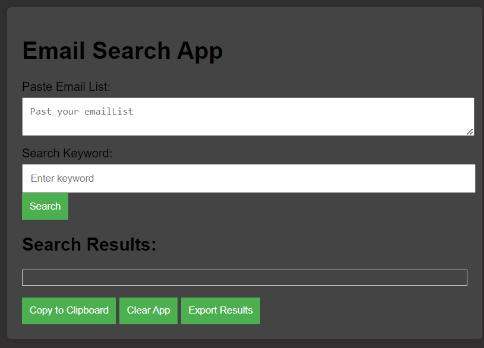

# Email Search Web App

## Overview

This simple web app allows users to search for specific keywords within an email list. Users can input a list of emails and a search keyword, and the app will filter and highlight the matching results.

## Features

- **Search Functionality:** Search for a specific keyword within the provided email list.
- **Highlight Search Results:** Matching results are highlighted for better visibility.
- **Clear App Button:** Reset the input fields and clear search results.
- **Error Handling:** Display informative error messages for better user feedback.
- **Responsive Design:** Ensures a consistent and user-friendly experience across various devices.
- **Loading Indicator:** Shows a loading message during the search process.
- **Export Results:** Export the search results to a text file for further analysis.

## How to Use

1. **Paste Email List:**
   - Enter the email list in the designated textarea, with each email on a new line.

2. **Enter Search Keyword:**
   - Input the keyword you want to search for within the email list.

3. **Click Search Button:**
   - Click the "Search" button to filter and highlight the matching results.

4. **Clear Results:**
   - Use the "Clear App" button to reset the input fields and clear the search results.

5. **Export Results:**
   - Click the "Export Results" button to download the search results as a text file.

## Additional Features

- **Highlight Color Customization:**
  - Users can customize the highlight color for search results.
  
- **Feedback Mechanism:**
  - Visual feedback for successful actions, such as highlighting results or clearing the app.

## License

This project is licensed under the MIT License - see the [LICENSE](LICENSE) file for details.
